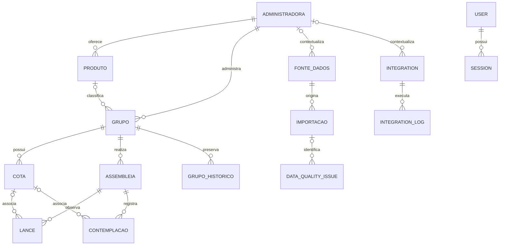

# Modelo de dados — Fase 03

## Evolução da Fase 19.1

`TabelaComercial` e `TabelaComercialItem` formam um domínio comercial próprio, sem reutilizar `Grupo` ou `Cota`. A tabela é versionada pela unicidade `(administradoraId, codigo, inicioVigencia)` e o item pela combinação `(tabelaComercialId, creditoReferencia, prazoMeses, modalidade)`. A administradora é obrigatória, o produto é opcional e deve pertencer à mesma administradora. Dinheiro usa `Decimal(19,2)`, percentuais `Decimal(9,6)`, vigência `DATE` e timestamps `TIMESTAMPTZ(3)`. Checks preservam limites e coerência temporal; FKs `RESTRICT` e ausência de `DELETE` preservam histórico. Detalhes em [TABELAS_COMERCIAIS.md](TABELAS_COMERCIAIS.md).

## Evolução da Fase 10

`GrupoHistorico` continua sendo a entidade originalmente prevista, agora evoluída para snapshot consolidado e imutável. Preserva estado operacional, métricas temporais, cobertura, contexto de qualidade, fonte/autoria e idempotência. Os Decimals permanecem `DECIMAL(19,2)` para valores financeiros e `DECIMAL(9,6)` para percentuais. As relações opcionais com `User`, `FonteDados` e `Importacao` usam `SET NULL`; o vínculo obrigatório com `Grupo` permanece `RESTRICT`. A unicidade `(grupoId, dataReferencia)` e `(grupoId, idempotencyKey)` atende ordenação e repetição segura.

## Evolução da Fase 09

`DataQualityIssue` agora mantém estado (`OPEN`, `IN_REVIEW`, `RESOLVED`, `IGNORED`), origem controlada, chave determinística única, contexto opcional de administradora/produto/grupo, metadados e a decisão de encerramento (`resolvedBy`, ação, observação e instante). O booleano legado `resolvido` permanece sincronizado por restrição para compatibilidade. Índices atendem filas por estado/severidade/data, regras e contexto; o histórico de transições permanece no `AuditLog`.

## Evolução da importação

`Importacao` registra tipo, ator opcional para legado, metadados, aba, colunas, mapping confirmado, estratégia, progresso e timestamps. `VALIDANDO`/`PRONTA` separam análise de confirmação. `DataQualityIssue` acrescenta linha e valor recebido. O caminho temporário é interno e fica nulo no término.

## Histórico de assembleias

`Assembleia` pertence a `Grupo` e mantém número opcional, instante real e status. `Lance` e `Contemplacao` pertencem a uma assembleia e aceitam `Cota` opcional; o serviço garante que a cota esteja no mesmo grupo. Percentuais são `Decimal(9,6)` e valores monetários `Decimal(19,2)`. Não há exclusão física nem mudança automática de status da cota.

## Escopo

O modelo inicial atende persistência genérica de consórcios, rastreabilidade de ingestão, histórico, qualidade e auditoria. Ele não codifica regras particulares de administradoras, não contém credenciais e não inclui dados comerciais de seed. A migration foi aplicada e inspecionada em PostgreSQL 17.11 real.

## Relacionamentos

`AuditLog` é deliberadamente desacoplado por `entity` e `entityId`: a ausência de uma tabela definitiva de usuários permite `actorId` opcional, e a auditoria continua preservada se a entidade de origem deixar de existir.

## Entidades

| Entidade           | Responsabilidade                                                     |
| ------------------ | -------------------------------------------------------------------- |
| `Administradora`   | Identidade e ativação de uma administradora, sem credenciais.        |
| `Produto`          | Modalidade comercial genérica associada à administradora.            |
| `Grupo`            | Grupo e limites conhecidos de crédito, prazo e cotas.                |
| `Cota`             | Dados individuais opcionais de uma cota conhecida.                   |
| `Assembleia`       | Ocorrência histórica de assembleia de um grupo.                      |
| `Lance`            | Lance observado ou importado, sem presumir regras universais.        |
| `Contemplacao`     | Resultado observado por sorteio, lance ou outro tipo textual.        |
| `GrupoHistorico`   | Snapshot imutável por grupo e data de referência.                    |
| `FonteDados`       | Origem não sensível de conjuntos de dados.                           |
| `Importacao`       | Execução e contadores de um processo de ingestão.                    |
| `DataQualityIssue` | Inconsistência rastreável e resolvível sem abortar toda ingestão.    |
| `Integration`      | Cadastro não sensível de uma integração futura, sem conector real.   |
| `IntegrationLog`   | Execução operacional de uma integração, sem secrets.                 |
| `AuditLog`         | Evento genérico de auditoria com ator ainda opcional.                |
| `User`             | Identidade mínima, email normalizado, hash Argon2id, papel e status. |
| `Session`          | Sessão revogável; contém somente hash do token e metadados técnicos. |

`Session` usa `Cascade` apenas em relação a `User`, pois uma sessão não possui valor sem sua identidade. O token bruto nunca é persistido. Índices cobrem hash único, usuário/expiração e usuário/revogação. CHECK constraints reforçam email normalizado, hashes não vazios, token hexadecimal de 64 caracteres e coerência temporal.

## Integridade e identificadores

Todas as chaves primárias usam UUID gerado pela aplicação/Prisma. Foreign keys usam `Restrict` como padrão para evitar remoção acidental de dados dependentes; relações de contexto opcionais usam `SetNull`; atualizações de chave usam `Cascade`. Não há cascata indiscriminada.

Unicidades impedem duplicação previsível, como grupo por administradora/código, cota por grupo/número, assembleia numerada por grupo, snapshot por grupo/data e códigos externos dentro de seu contexto. Índices cobrem filtros por administradora, status, grupo, data, fonte, importação e entidade auditada. CHECK constraints garantem textos obrigatórios não vazios, CNPJ com 14 dígitos, períodos coerentes, contadores e valores não negativos, mínimos menores ou iguais aos máximos, percentuais entre 0 e 100 e coerência de resolução de problemas.

A inspeção real confirmou 14 tabelas de domínio (15 com `_prisma_migrations`), 15 foreign keys, 26 CHECK constraints, 54 índices e 3 enums. Testes PostgreSQL controlados confirmaram unicidade, `NOT NULL`, FK inválida, percentuais/valores fora do limite, `Restrict` e `SetNull`.

## Tipos flexíveis e JSON

Categorias de produto, estados e tipos específicos de administradoras são texto porque ainda não existe contrato universal. Enums foram usados somente em estados controlados pela própria plataforma: tipo de fonte, status de importação e severidade de qualidade. Isso evita migrations frequentes para vocabulários externos ainda desconhecidos.

JSON aparece apenas em observações estruturadas, configuração não sensível e metadata de auditoria. Dados relacionais centrais permanecem normalizados. Tokens, senhas, client secrets e outras credenciais deverão ficar em um secret manager; referências a secrets poderão ser modeladas em fase futura.

## Dinheiro, percentuais e datas

Valores monetários usam `Decimal(19,2)`/`NUMERIC(19,2)`, suficiente para créditos elevados sem erro binário de `Float`. Percentuais usam `Decimal(9,6)` para preservar precisão nas fontes e são limitados de 0 a 100 no banco.

Instantes usam `TIMESTAMPTZ(3)` e devem ser persistidos em UTC. Datas civis de início/encerramento de grupo usam `DATE`. Conversão para o fuso brasileiro pertence à aplicação/interface.

## Histórico, auditoria e exclusão

Novos snapshots de `GrupoHistorico` são inseridos; não substituem registros anteriores. Importações, problemas de qualidade, logs de integração e auditoria também são registros preserváveis. Não existe `deletedAt` global: administradoras, produtos e fontes podem ser desativados, enquanto remoções de dados históricos são restringidas por foreign keys. Uma política formal de retenção e anonimização deverá preceder dados pessoais reais.

## Linhagem e próximos passos

`FonteDados -> Importacao -> DataQualityIssue` registra a linhagem do processo e suas inconsistências. A linhagem por registro de domínio poderá ser acrescentada quando o formato real dos importadores for definido. Migration, persistência e backup/restore locais estão validados; repositories futuros devem existir somente para casos de uso aprovados, sem introduzir um repository genérico universal.

## Extensão comercial da Fase 14

`Lead` armazena identificação mínima, perfil, funil, responsável e consentimento. `LeadInteresse` é N:1 com Lead e Grupo e guarda snapshot comercial; `LeadInteracao` é histórico imutável. Telefone/e-mail possuem índices não únicos. Um índice parcial PostgreSQL garante uma opção principal por lead. Detalhes em [CRM_LEADS.md](CRM_LEADS.md).
